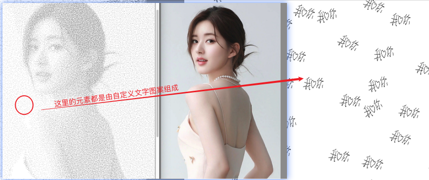

# 用自定义的签名或者图案，将目标图片转成素描风格的图片。目标图片全部由签名组成。




## 使用说明

### 安装python3 
### 安装依赖


```shell
pip install Pillow numpy
```

* 1 将目标图片存入到out-pics 内更改名称为protrait.jpg 
* 2 运行signPad.py 会弹窗签名版，在这里写上或者画出需要的图案，点击保存。会在out-pics里生成图片signature.png 
* 3 运行drawPic.py 完成后会生成图片

特别说明，目标图片最好是浅色，不要特别深，不然会黑
如果效果不理想可以调节drawPic.py 中以下参数的大小

```python
block_size=5,                # 每个签名块对应的人像图片区域大小，可根据需要调整，这个参数控制了图片大小和效果，建议3-7 之间。如果过小图片会很大，过大效果不好
signature_size=(100, 100),      # 签名图片在最终图像中的大小，可根据需要调整
max_signatures=15            # 每个区域最多叠加的签名数量，可根据需要调整，如果很多就会重复叠加导致部分区域很黑，看不清签名，如果很小，就会出现图片不明显，签名很稀疏
```

